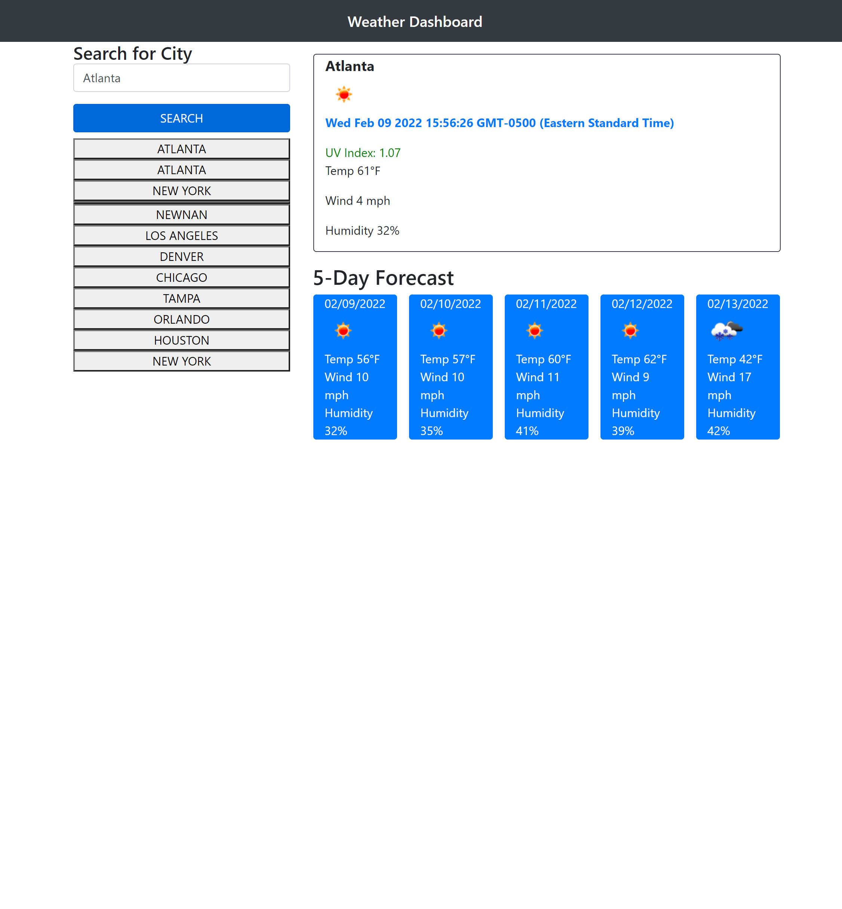

# weather-dashboard
A weather dashboard that will run in the browser and feature dynamically updated HTML and CSS.

## Description
This weather dashboard takes advantage of the OpenWeatherMap API, a Third-party API which allows 
developers to access their data and functionality by making requests with 
specific parameters to a URL. Developers are often tasked with retrieving data from another 
application's API and using it to add vital information and animation to their projects.
<a href="https://jamillerooks.github.io/weather-dashboard/" target="_blank">Link to Weather Dashboard website</a>

# Mock-up

# Contribution Guidelines
Your suggestions are welcome to help us achieve the goal of improved website accessibility and SEO ranking. 

We use Github and all it's built-in features to host the website, and to pull requests to the local repository.

Report all bugs to Github <a href="https://github.com/issues" target="_blank">issues</a> 

This website uses semantic HTML elements, and universal, element, and class selectors in CSS.

# License
All submissions to this project will fall under <a href="https://choosealicense.com/licenses/mit/" target="_blank">MIT License.</a>
